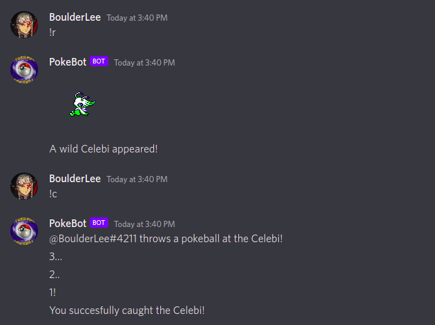
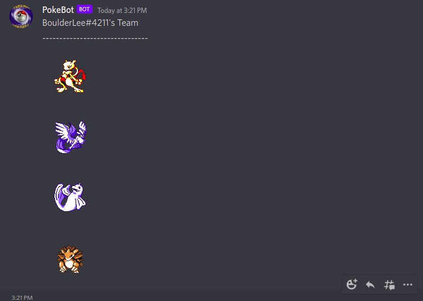

# PokemonDiscordBot
A simple pokemon bot written in Node.js

Pokebot allows for the capture and battle of pokemon just like in the popular games!

# Current Commands
Current commands for pokebot include the following:

        !R/!r - Roll for a new wild encounter! (Gens 1 and 2)
        !C/!c - Attempt to catch the current encounter!
        !pokemon - Display a list of all pokemon held by the user

# Sample outputs V0.1

Once the pokemon is caught the user can display their collection by calling '!pokemon'

# Current Pokedex

As of v0.1, PokeBot supports pokemon Gens I - IV, now that a decent selection of pokemon are
available battle mechanice will become a priority.

